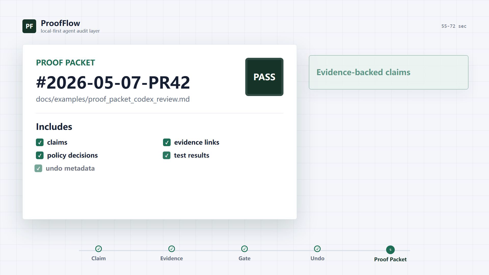
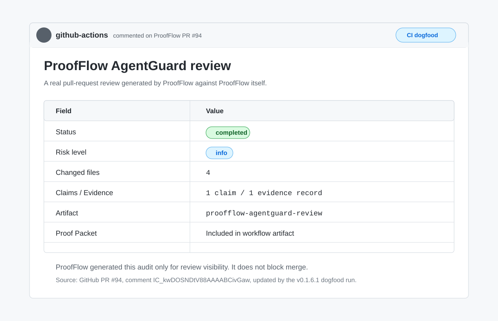

# ProofFlow

[English](README.md) | [简体中文](README.zh-CN.md)

**CI Proof Packets for AI code review.**

Vibe coding is fast. Blind trust is not enough.

ProofFlow makes AI-generated pull requests reviewable, traceable, and
reversible through evidence-backed claims, CI review artifacts, policy gates,
undo metadata, and human maintainer review.

**Latest release:** [v0.1.6.1 - Dogfood Polish for CI Review Comments](https://github.com/Hyperion-GPU/ProofFlow-v0.1/releases/tag/v0.1.6.1)

▶ **Watch the 72s demo:** [From AI agent claims to verifiable Proof Packets](https://github.com/Hyperion-GPU/ProofFlow-v0.1/releases/tag/v0.1.3)<br>
📦 **Example Proof Packets:** [`code review`](docs/examples/proof_packet_codex_review.md) · [`issue triage`](docs/examples/proof_packet_issue_triage.md)

**Maintainer workflow:** [`docs/maintainer_evidence_workflow.md`](docs/maintainer_evidence_workflow.md)

**AgentGuard semantic rules:** [`docs/agentguard_semantic_rules.md`](docs/agentguard_semantic_rules.md)

[](https://github.com/Hyperion-GPU/ProofFlow-v0.1/releases/tag/v0.1.3)

## ProofFlow Reviewed ProofFlow

ProofFlow v0.1.6 was dogfooded on a real repository PR. The GitHub Actions
workflow ran AgentGuard, posted a stable PR summary comment, uploaded
`summary.json`, and exported a downloadable Proof Packet.

[](https://github.com/Hyperion-GPU/ProofFlow-v0.1/pull/94#issuecomment-4465608299)

- Real PR: [#94 Dogfood v0.1.6 CI review story](https://github.com/Hyperion-GPU/ProofFlow-v0.1/pull/94)
- Review run: [ProofFlow PR Review #25953071865](https://github.com/Hyperion-GPU/ProofFlow-v0.1/actions/runs/25953071865)
- Patch release from dogfood feedback: [v0.1.6.1](https://github.com/Hyperion-GPU/ProofFlow-v0.1/releases/tag/v0.1.6.1)
- Result: one stable comment updated across pushes, one artifact containing the
  Proof Packet and `summary.json`, no merge blocking.

[](https://github.com/Hyperion-GPU/ProofFlow-v0.1/actions/workflows/backend.yml)
[](https://github.com/Hyperion-GPU/ProofFlow-v0.1/actions/workflows/frontend.yml)
[](https://github.com/Hyperion-GPU/ProofFlow-v0.1/actions/workflows/mcp-server.yml)
[](https://marketplace.visualstudio.com/items?itemName=hyperion-gpu.proofflow)
[](https://pypi.org/project/proofflow-mcp/)
[](https://opensource.org/licenses/MIT)

## Problem

AI coding agents (Claude Code, Codex, Copilot Workspace) can modify files, run commands, and make decisions autonomously. But there's no standard way to:

- **Audit** what an agent did and why
- **Gate** high-risk actions before they execute
- **Prove** that a code review actually checked what it claims
- **Undo** agent-initiated changes with confidence

ProofFlow solves this by sitting between the agent and the filesystem, creating an evidence graph that links every action to its justification.

## Quickstart

### Docker (recommended)

```bash
git clone https://github.com/Hyperion-GPU/ProofFlow-v0.1.git
cd ProofFlow-v0.1
docker compose up
```

Backend: http://localhost:8787 | Frontend: http://localhost:5173

Docker publishes both ports on `127.0.0.1` by default to preserve ProofFlow's
localhost trust boundary. For stronger local protection, set an API key before
starting:

```bash
PROOFFLOW_API_KEY=change-me docker compose up
```

If you enable backend auth for the Docker frontend, use the same
`PROOFFLOW_API_KEY` value at build time so Vite can embed
`VITE_PROOFFLOW_API_KEY` in the static frontend bundle. AgentGuard
`test_command` execution is disabled by default; set
`PROOFFLOW_ENABLE_TEST_COMMANDS=true` only when you intentionally want the
backend to run local test commands during review.

### Manual

```bash
# Backend
cd backend && pip install -r requirements.txt
python -m uvicorn proofflow.main:app --port 8787

# Frontend
cd frontend && npm ci && npm run dev
```

### MCP Integration (Claude Code / Codex)

```bash
pip install proofflow-mcp
```

Add to your project's `.mcp.json`:

```json
{
  "mcpServers": {
    "proofflow": {
      "command": "proofflow-mcp",
      "env": { "PROOFFLOW_BASE_URL": "http://127.0.0.1:8787" }
    }
  }
}
```

Now your AI agent can scan files, review code, triage issues, suggest actions, and export audit reports — all with enforced safety gates.

### Codex Maintainer Plugin

ProofFlow also includes a repo-local Codex plugin at
[`plugins/proofflow-maintainer`](plugins/proofflow-maintainer). It provides
starter prompts and a maintainer-focused skill for:

- reviewing the current diff with ProofFlow,
- creating a Proof Packet for a PR,
- triaging issue text into a ProofFlow Case.

The plugin uses the same local `proofflow-mcp` server and keeps the backend
trust boundary at `http://127.0.0.1:8787`.

## Architecture

```
AI Agent (Claude Code / Codex / Custom)
    |
    | MCP Protocol (stdio)
    v
ProofFlow MCP Server (13 tools)
    |
    | HTTP REST API
    v
ProofFlow Backend (FastAPI + SQLite)
    |
    |--- Evidence Graph: Cases > Artifacts > Claims > Evidence
    |--- Action Pipeline: Preview > Approve > Execute > Undo
    |--- Policy Gates: Risk classification > Owner decision
    |--- Proof Packets: Exportable markdown audit reports
    v
Local Filesystem (scanned files, git repos)
```

## Core Capabilities

### Evidence-Backed Code Review (AgentGuard)
Analyzes git diffs, generates risk-scored claims, and links each claim to specific evidence (changed lines, test results). No claim exists without supporting evidence.

### File Audit & Organization (LocalProof)
Scans directories, indexes files with SHA-256 hashes, extracts text for full-text search, and suggests organization actions — all tracked in an auditable Case.

### Issue Triage
Captures issue text as a first-class Case with source Artifact, deterministic triage Claims, component inference, label suggestions, and Proof Packet export.

### Policy Gate Enforcement
High-risk filesystem actions (moves to system paths, bulk operations) are automatically paused at `pending_decision` status. Requires explicit owner approval before execution.

### Safety Invariants
- **No Preview, no Action** — destructive operations require two-phase confirmation
- **No Evidence, no Claim** — every assertion links to verifiable data
- **No Undo, no Destructive Action** — executed actions carry rollback metadata
- **No Case, no Workflow** — all work is tracked in auditable containers

### MCP Tool Suite (13 tools)
`health` · `scan` · `suggest` · `review` · `triage_issue` · `status` · `approve_execute` · `export_packet` · `search` · `list_cases` · `list_actions` · `undo` · `decide`

## Technical Stack

| Layer | Technology | Tests |
|-------|-----------|-------|
| Backend | Python 3.12, FastAPI, SQLite | 300 |
| Frontend | React 19, TypeScript, Vite | 25 |
| MCP Server | Python, MCP SDK, httpx | 26 |
| CI | GitHub Actions (PR review + release gates) | Audit artifact + PR comment |

## Security Features

- Optional API key authentication (`PROOFFLOW_API_KEY`)
- Rate limiting (`PROOFFLOW_RATE_LIMIT`)
- AgentGuard test command execution is opt-in (`PROOFFLOW_ENABLE_TEST_COMMANDS`)
- MCP concurrency guards (`PROOFFLOW_MCP_MAX_CONCURRENT`)
- Filesystem action scope restrictions (allowed_roots)
- CORS locked to localhost origins

## Project Status

**v0.1.0 — Stable release.** All core workflows functional, tested, and documented.

| Milestone | Status |
|-----------|--------|
| Core evidence graph (Case/Artifact/Claim/Evidence) | Done |
| LocalProof file audit workflow | Done |
| AgentGuard code review workflow | Done |
| Issue triage workflow | Done |
| Policy gate enforcement | Done |
| MCP server for Claude Code/Codex | Done |
| Backup/restore with safety preview | Done |
| Docker deployment | Done |
| PyPI package (`proofflow-mcp`) | Done |

## Roadmap

- [ ] Multi-agent coordination (shared Cases across agents)
- [ ] Vector RAG for semantic evidence retrieval
- [x] GitHub Actions integration (CI-triggered reviews)
- [x] VS Code extension ([Marketplace](https://marketplace.visualstudio.com/items?itemName=hyperion-gpu.proofflow))
- [ ] Cloud sync option for team workflows
- [ ] Webhook notifications for policy gate decisions

## Development

```bash
# Run all tests
cd backend && python -m pytest          # 295 tests
cd frontend && npm run test             # 25 tests
cd mcp-server && pip install -e ".[dev]" && python -m pytest  # 24 tests

# End-to-end smoke test
python scripts/mcp_smoke.py --cleanup

# Demo workflow
python scripts/demo_workflow.py
```

Local backend data defaults to `backend/data/`. For dogfood runs that should not
touch repository-local state, set `PROOFFLOW_DB_PATH` and `PROOFFLOW_DATA_DIR`
to a temporary directory before starting the backend.

## Contributing

We welcome contributions! Please see [CONTRIBUTING.md](CONTRIBUTING.md) for guidelines.

- [Code of Conduct](CODE_OF_CONDUCT.md)
- [Security Policy](SECURITY.md)

## License

MIT

---

Built by [Hyperion-GPU](https://github.com/Hyperion-GPU) — making AI agent workflows auditable, safe, and provable.
