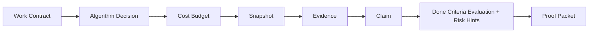

# Agent Work Ledger

ProofFlow records AI coding work as a local, evidence-backed delivery ledger.
The goal is not only to review a final diff, but to preserve the contract,
algorithm choice, cost budget, code state, claims, evidence, evaluation, and
exported packet that explain why the work should be trusted.

## Main Flow

## What Each Step Proves

| Step | Purpose | Stored as |
| --- | --- | --- |
| Work Contract | Objective, repo path, allowed scope, forbidden actions, required tests, done criteria, evidence requirements, algorithm requirements, and cost budget | `agent_work_ledger` Case metadata |
| Algorithm Decision | The selected algorithm or workflow, rationale, rejected alternatives, invariants, and forbidden approaches | `algorithm_decision` Artifact |
| Cost Budget | Token, API, GPU, CPU, runtime, iteration, or other cost limits before expensive work begins | `cost_budget` Artifact |
| Snapshot | Git diff, changed files, HEAD SHA, base ref, status, and diff hash | `git_diff` Artifact |
| Evidence | Test output, command output, notes, screenshots, or supporting files | Artifact + Evidence row |
| Claim | A statement the agent wants the maintainer to trust | Claim bound to Evidence |
| Evaluation | Deterministic check for tests, algorithm decisions, cost budget, scope, evidence, open risks, and non-blocking Risk Hints | `ledger_evaluation` Run |
| Proof Packet | Exported markdown handoff for review, audit, and PR comments | `proof_packet` Artifact |

## Relationship To Existing Workflows

Agent Work Ledger is the container workflow for complex AI coding tasks.
AgentGuard, Issue Triage, LocalProof, and policy gates still matter, but the
Ledger gives them a shared delivery context:

- **AgentGuard** reviews diffs and creates evidence-backed review claims.
- **Issue Triage** turns issue text into a source Artifact with deterministic
  Claims and Evidence.
- **LocalProof** scans and indexes local files for searchable Artifacts.
- **Policy gates** preserve preview, approval, decision, execution, and undo
  evidence for risky actions.
- **Ledger** connects those artifacts to the original contract and final done
  criteria evaluation.

## Hard Rules

- No Contract, no Ledger.
- No Algorithm Decision, no trusted implementation strategy when the contract
  requires one.
- No Cost Budget, no expensive workflow when the contract declares budget
  limits.
- No final Snapshot, no Finish.
- No Evidence, no trusted Claim.
- No ready Evaluation, no quiet success.
- Snapshot diff/hash must appear in the Proof Packet.
- Unaccepted medium/high risks require explicit Decision evidence.

## Evaluation Outcomes

Evaluation returns `risk_hints` alongside pass/fail status. Hints do not change
`ready_for_review`; they tell the maintainer when the evidence flow suggests a
route worth checking, such as regeneration where the contract asked for mapping,
or recorded API/GPU usage above the declared Cost Budget.

| Status | Meaning |
| --- | --- |
| `ready_for_review` | Contract checks passed and the Ledger can be reviewed as complete. |
| `needs_tests` | A required test command is missing from Evidence or Artifacts. |
| `scope_violation` | Final snapshot changed files outside `allowed_scope`. |
| `missing_algorithm_decision` | The contract requires an algorithm decision, but no Algorithm Decision Artifact exists. |
| `missing_cost_budget` | The contract declares a cost budget, but no Cost Budget Artifact exists. |
| `incomplete_evidence` | Required evidence types are missing. |
| `risk_acceptance_required` | Open medium/high Claims need an accepted Decision. |
| `finished_with_risks` | Finish was allowed, but the latest evaluation was not ready. |

## Risk Hints

Risk Hints are deterministic prompts, not automatic verdicts. They can surface
cases where the work ran and tests passed, but the recorded route may still be
wrong or too expensive:

- `forbidden_algorithm_mentioned`
- `regeneration_over_mapping`
- `expensive_action_without_budget`
- `cost_budget_possible_overrun`
- `test_proves_output_not_method`

See [`ledger_risk_hints.md`](ledger_risk_hints.md) for rule details and
expected false positives.

## Why This Matters

AI agents can change code quickly, but maintainers need a compact record of
what was promised, what changed, what was tested, what was claimed, and what
risks remain. The Ledger gives AI coding work a local, verifiable, exportable
handoff instead of an unstructured chat transcript.
