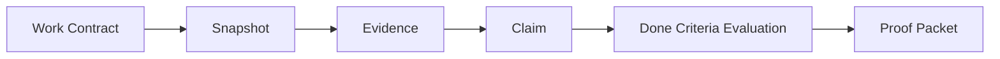

# ProofFlow v0.1.8 Release Draft

Status: draft

ProofFlow v0.1.8 reframes the project around Agent Work Ledger for AI coding:
contract first, evidence-backed claims, done criteria evaluation, and Proof
Packet export. The release keeps ProofFlow local-first while making complex AI
coding work reviewable as a durable delivery record, not just a final PR diff.

## Highlights

- Agent Work Ledger is now a first-class backend workflow with REST APIs for
  contract start, timeline events, snapshots, Evidence, Claims, done criteria
  evaluation, finish state, and Proof Packet export.
- Ledger Proof Packets now include Work Contract, Ledger Timeline, Snapshots,
  Done Criteria Evaluation, Claims & Evidence, and Remaining Risks.
- MCP exposes the full Ledger chain through tools for Codex, Claude, and other
  MCP clients:
  `proofflow_start_work_contract`,
  `proofflow_record_event`,
  `proofflow_capture_snapshot`,
  `proofflow_record_evidence`,
  `proofflow_record_claim`,
  `proofflow_evaluate_contract`, and
  `proofflow_finish_work_ledger`.
- Hard rules prevent quiet success:
  Claims must bind Evidence, final snapshots are required before finish,
  non-ready evaluations finish as `finished_with_risks`, and snapshot diff/hash
  data appears in Proof Packets.
- Packaging docs now explain the Ledger adoption path, a five-minute MCP
  quickstart, dogfood packet examples, and a PR comment template.

## Main Flow

## Dogfood Evidence

Ledger dogfood verified the full live flow against a local ProofFlow backend
and MCP client:

- Start a work contract.
- Capture start and final snapshots.
- Record test output as Evidence.
- Bind a test Claim to Evidence.
- Evaluate done criteria.
- Finish the Ledger.
- Export a Proof Packet.

Observed evaluator and hard-rule behavior:

| Scenario | Observed result |
| --- | --- |
| Missing required test evidence | `needs_tests` |
| Changed files outside allowed scope | `scope_violation` |
| Claim with empty `evidence_ids` | HTTP 422 |
| Open medium/high risk without accepted Decision | `risk_acceptance_required` |
| Finish after non-ready evaluation | `finished_with_risks` |
| Finish without final snapshot | HTTP 400 |

The dogfood pass also found and fixed a dotfile scope bug:
`.codex/config.toml` must stay `.codex/config.toml`, not `codex/config.toml`.

Relevant PRs:

- PR #103: Codex maintainer plugin
- PR #104: AgentGuard semantic rules docs and example packet
- PR #105: first-class issue triage backend/MCP workflow
- PR #106: Issue Triage UI entry and packet example
- PR #107: Agent Work Ledger workflow and hardening
- PR #108: Agent Work Ledger adoption docs
- PR #109: Ledger MCP quickstart
- PR #110: Ledger dogfood examples and PR comment template

## Documentation

- Ledger architecture:
  [`docs/agent_work_ledger.md`](../agent_work_ledger.md)
- MCP quickstart:
  [`docs/ledger_quickstart_mcp.md`](../ledger_quickstart_mcp.md)
- Public-safe dogfood packet:
  [`docs/examples/proof_packet_agent_work_ledger_dogfood.md`](../examples/proof_packet_agent_work_ledger_dogfood.md)
- PR comment template:
  [`docs/examples/pr_comment_agent_work_ledger.md`](../examples/pr_comment_agent_work_ledger.md)

## Validation

- Backend selected tests: `38 passed`
  - `backend/tests/test_agent_work_ledger.py`
  - `backend/tests/test_reports_export.py`
  - `backend/tests/test_case_packet_api.py`
  - `backend/tests/test_cases_api.py`
  - `backend/tests/test_artifacts_api.py`
  - `backend/tests/test_search_api.py`
  - `backend/tests/test_agentguard_review.py`
- MCP tests: `40 passed`
- `python -m compileall backend\proofflow mcp-server\src\proofflow_mcp` -> passed
- `git diff --check` -> passed with only Git LF/CRLF warnings
- GitHub CI for PRs #107 through #110 passed Backend, Frontend, Lint, MCP
  Server, and ProofFlow PR Review checks.

## Breaking Changes

None.

## Intentionally Not Included

- No dedicated Ledger database table.
- No hosted service, cloud sync, telemetry, or remote review backend.
- No merge blocking.
- No VS Code Ledger panel yet.
- No standalone CLI Ledger command yet.
- No GitHub Action Ledger comment automation yet.
