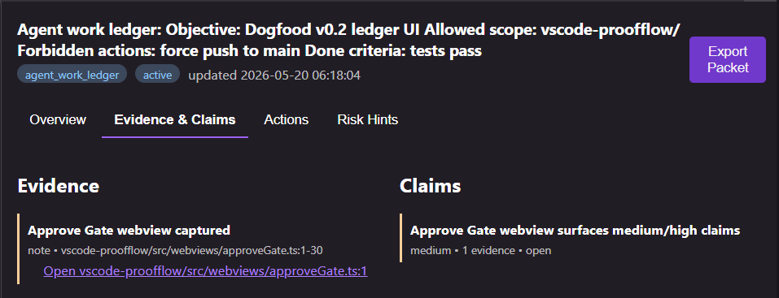
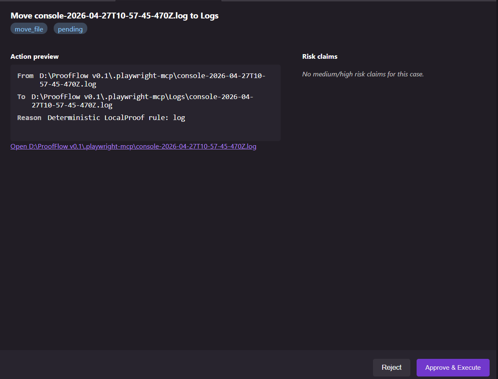

# ProofFlow for VS Code

> Audit, gate, and trace every change your AI coding agent makes — without leaving the editor.

ProofFlow is a local-first audit layer for AI coding agents (Codex, Claude Code, Copilot Workspace, Cursor). This extension is the VS Code companion: it connects to a local ProofFlow backend, surfaces ledger state in the sidebar, and gives you rich webviews for case detail review and Approve Gate decisions.

The extension talks to a local ProofFlow backend (`http://127.0.0.1:8787` by default). All data stays on your machine.





## Features

- **🛡 One-click AI change review** — `ProofFlow: Review Last AI Changes` runs AgentGuard on the current workspace's git diff and creates an evidence-backed Case.
- **📂 Folder scan** — `ProofFlow: Scan Current Folder` indexes every file with SHA-256 hashes for cleanup or audit.
- **🌳 Cases tree** — Browse all Cases. Expand to see Actions and Claims with severity-coded icons.
- **🧾 Active Ledger tree** — Dedicated sidebar view for open Agent Work Ledger Cases with Contract, Algorithm Decisions, Cost Budgets, Snapshots, Evidence, Claims, and Evaluations sections.
- **📋 Case Detail webview** — Click any case to open a 4-tab panel: Overview, Evidence & Claims (with linked highlighting), Actions, Risk Hints. Export Proof Packet from the header.
- **✅ Approve Gate webview** — Rich review pane with action preview on the left, medium/high risk claims on the right, and one-click Approve / Reject / Explain.
- **🚦 Status bar** — Surfaces backend lifecycle (`starting`, `ready`, `restarting`, `failed`), connectivity, and pending-action count.
- **🔄 Auto-refresh** — Polls the backend every 10 seconds; configurable.

## Quick Start

### 1. Install the ProofFlow backend

```bash
git clone https://github.com/Hyperion-GPU/ProofFlow-v0.1.git
cd ProofFlow-v0.1
docker compose up
```

Or run it locally:

```bash
cd ProofFlow-v0.1/backend
pip install -r requirements.txt
python -m uvicorn proofflow.main:app --port 8787
```

### 2. Install the extension

Search **ProofFlow** in the VS Code marketplace, or install from a `.vsix`:

```bash
code --install-extension proofflow-0.1.5.vsix
```

### 3. Use it

1. Open any git project in VS Code.
2. The status bar should show `🛡 ProofFlow` once the backend is reachable at `proofflow.backendUrl`.
3. Open the command palette (`Ctrl+Shift+P` / `Cmd+Shift+P`) → run **ProofFlow: Review Last AI Changes**.
4. Open the ProofFlow sidebar (shield icon in the activity bar) to see the new Case in the **Cases** view; ledger cases also appear in **Active Ledger**.
5. Click any case to open the rich Case Detail webview.

## Commands

| Command | What it does |
|---|---|
| `ProofFlow: Review Last AI Changes` | Runs AgentGuard on the current workspace and creates a code-review Case. |
| `ProofFlow: Scan Current Folder` | Indexes every file in the workspace as artifacts. |
| `ProofFlow: Approve Gate & Execute` | Open the Approve Gate webview to review and decide on pending actions. |
| `ProofFlow: Ledger — Start Work Contract` | Create a new Agent Work Ledger Case with objective, scope, and done criteria. |
| `ProofFlow: Ledger — Record Event` / `Algorithm Decision` / `Cost Budget` / `Snapshot` / `Evidence` / `Claim` | Append the corresponding ledger artifact. |
| `ProofFlow: Ledger — Evaluate Contract` | Run the contract evaluator and surface failed criteria + risk hints. |
| `ProofFlow: Ledger — Finish` | Close out the ledger with an optional final summary. |
| `ProofFlow: Open Case Detail` | Open the rich Case Detail webview for the selected case. |
| `ProofFlow: Export Proof Packet` | Export the case as markdown to `.proofflow/exports/` and open the preview. |
| `ProofFlow: Show Logs` | Open the ProofFlow output channel for debugging. |
| `Refresh` (sidebar title bar) | Force a tree refresh. |

## Configuration

| Setting | Default | Description |
|---|---|---|
| `proofflow.backendUrl` | `http://127.0.0.1:8787` | URL of the ProofFlow backend. |
| `proofflow.apiKey` | `""` | Optional `X-ProofFlow-Token` for authenticated backends. |
| `proofflow.autoRefresh` | `true` | Poll the backend every 10 seconds for status and pending actions. |

## How it fits with the rest of ProofFlow

```
┌──────────────┐                       ┌──────────────────┐
│   VS Code    │   HTTP (REST + JSON)  │ ProofFlow backend│
│  extension   │ ────────────────────▶ │   (localhost)    │
└──────────────┘                       └──────────────────┘
                                              │
                                              ▼
                                       SQLite + content store
                                       (everything stays local)
```

The same backend powers the MCP server that AI clients (Claude Code, Codex) use, so humans (this extension) and agents (MCP) operate against one source of truth — including the Agent Work Ledger lifecycle.

## Troubleshooting

**Status bar shows `Backend offline`**
The backend isn't reachable. Start it (see Quick Start) or check `proofflow.backendUrl`.

**`No workspace folder open`**
Open a folder via `File → Open Folder...` first. The Review command needs a git repo to diff.

**Sidebar shows "No cases found" after a successful review**
Click the 🔄 refresh button in the sidebar header, or wait for the next 10-second poll.

**See what's happening under the hood**
Run `ProofFlow: Show Logs` to open the output channel — every backend call and lifecycle event is logged.

## Repository

Source, issues, roadmap: https://github.com/Hyperion-GPU/ProofFlow-v0.1

## License

MIT — see [LICENSE](LICENSE).
